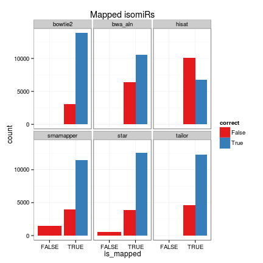
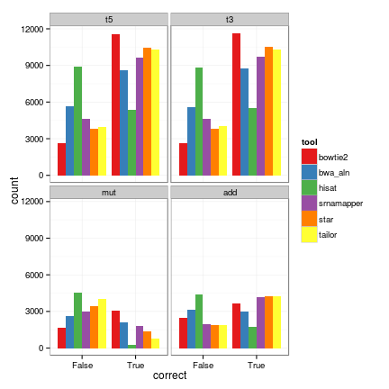
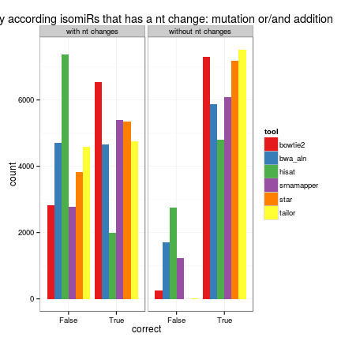
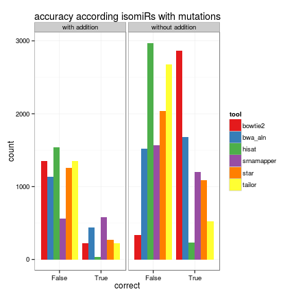
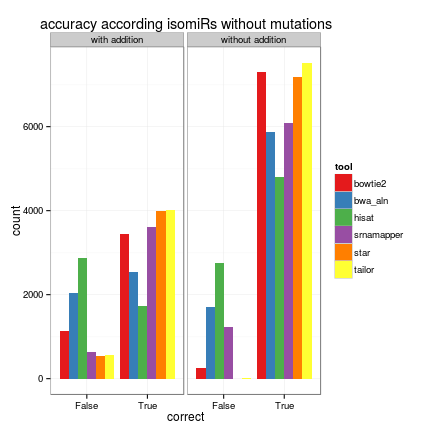
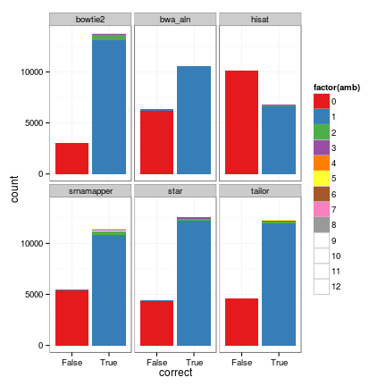

```r
data <- read.table("summary.tsv", header = T, sep = " ")
```

# Overview

The idea of this report is to show how well aligners are detecting
[miRNA/isomiRs](http://en.wikipedia.org/wiki/IsomiR) using the whole genome as reference instead of
using a specific database (such as, miRBase). I hope results
help people decide when is good to align directly to the genome.

I simulated a bunch of isomiRs (~16900) that can have the following variation:

* starts at different position than the reference miRNA: t5
* ends at different position than the reference miRNA: t3
* have a nucleotide change in a position: muts
* have nucleotide addition at the end: add

## Methods

The simulation was done with a small script inside [SeqBuster tool](https://github.com/lpantano/seqbuster/blob/master/misc/miRNA.simulator.py).
I used human miRBase to simulate isomiRs from precursors. I allowed trimming
events at both sides up to 3 nucleotides, 1 nucleotide mutation and 
up to 3 nucleotides for addition events.

Then, I used STAR, bowtie2 and HISAT to map to the genome in order to measure
how good these tools are detecting the correct place. I wrapped everything
into the following script: [run_analysis.py](https://github.com/lpantano/tools-mixer/blob/master/mirna/genome_based_mirna_annotation/run_tools.py). 
Want to mention that I didn't put much effort to
check parameters and tools, but if you have these tools installed, it
should be pretty easy to reproduce results.

# Results 

### summary


```r
data$is_mapped = (data$mapped != "False")
ggplot(data, aes(x = is_mapped, fill = correct)) + geom_bar(position = "dodge") + 
    scale_fill_brewer(palette = "Set1") + facet_wrap(~tool) + ggtitle("Mapped isomiRs")
```

 

All tools fail to map the majority of isomiRs, and HISAT is not so good at this. 
I am sure that there are parameters that will improve this, but it is
good to know that using default values don't work. Furthermore, many of 
them are not correct. We can expect to detect 60% of the sequenced isomiRs
if this strategy is used.

If you want to know what is the accuracy when mapping to miRBase directly,
[read this post](https://lorenapantano.wordpress.com/2014/02/28/mirna-annotation-tools-which-is-the-best/). Both reports use the same simulated isomiRs file.

### accuracy

It is interesting to know which changes affect more to the mapping accuracy. In this case nucleotides changes and additions. Addition is a post-transcriptional event that has been probe to be abundant in isomiRs, and even relevant in some cases, like development and aging. 


```r
library(ggplot2)
library(reshape)
data_gg <- melt(data, id.vars = c("seq", "known", "correct", "mapped", "amb", 
    "is_mapped", "tool"))
ggplot(data_gg %>% filter(value == "True"), aes(correct, fill = tool)) + geom_bar(position = "dodge") + 
    scale_fill_brewer(palette = "Set1") + theme_bw() + facet_wrap(~variable)
```

 


If we merge mutations and additions that are the ones that affect more the alignment:


```r
library(ggplot2)
library(reshape)
nt_changes = paste0(data$mut, data$add)
data$nt_changes = "without nt changes"
data$nt_changes[grepl("True", nt_changes)] = "with nt changes"

ggplot(data %>% filter(is_mapped == "TRUE"), aes(correct, fill = tool)) + geom_bar(position = "dodge") + 
    scale_fill_brewer(palette = "Set1") + theme_bw() + facet_wrap(~nt_changes) + 
    ggtitle("accuracy according isomiRs that has a nt change: mutation or/and addition")
```

 

We detect that the problem is when randomly changing nt from the reference miRNA it 
becomes similar to another miRNA or sequence. 

If we only consider additions as nt changes:


```r
library(ggplot2)
library(reshape)
data$nt_changes = "without addition"
data$nt_changes[grepl("True", data$add)] = "with addition"

ggplot(data %>% filter(is_mapped == "TRUE", mut == "True"), aes(correct, fill = tool)) + 
    geom_bar(position = "dodge") + scale_fill_brewer(palette = "Set1") + theme_bw() + 
    facet_wrap(~nt_changes) + ggtitle("accuracy according isomiRs with mutations")
```

 

```r
ggplot(data %>% filter(is_mapped == "TRUE", mut == "False"), aes(correct, fill = tool)) + 
    geom_bar(position = "dodge") + scale_fill_brewer(palette = "Set1") + theme_bw() + 
    facet_wrap(~nt_changes) + ggtitle("accuracy according isomiRs without mutations")
```

 

In conclusion:

With isomirs with mutations alone, bowtie2 works better.

With isomirs with mutation + addition, all perform poorly.

With addition alone, star and tailor are better.

### multi-mapped

Many people filter out the sequences that map multiple times on the genome.
I count the times sequences were mapping to another miRNA, and as expected, it
is a minority, but you will lose them if you apply the filter.


```r
ggplot(data, aes(correct, fill = factor(amb))) + geom_bar() + # scale_fill_hue('number of times annotated', colours = 'blue') +
theme_bw() + facet_wrap(~tool)
```

 
