---
output:
  knitrBootstrap::bootstrap_document:
    theme: readable
    highlight: zenburn
    theme.chooser: TRUE
    highlight.chooser: TRUE
  html_document:
    toc: true
    highlight: zenburn
---

last update Fri Oct 16 18:31:14 2015 by @lopantano


For replication [go here](http://seqcluster.readthedocs.org/example_pipeline.html)

Document with R code [go here](http://github.com/lpantano/seqcluster/docs/post/mirqc/report_with_code.md)


# Overview

mirRQC project [paper](http://www.nature.com/nmeth/journal/v11/n8/full/nmeth.3014.html)

samples overview:

> Universal Human miRNA reference RNA (Agilent Technologies, #750700), human brain total RNA (Life Technologies, #AM6050), human liver total RNA (Life Technologies, #AM7960) and MS2-phage RNA (Roche, #10165948001) were diluted to a platform-specific concentration. RNA integrity and purity were evaluated using the Experion automated gel electrophoresis system (Bio-Rad) and Nanodrop spectrophotometer. All RNA samples were of high quality (miRQC A: RNA quality index (RQI, scale from 0 to 10) = 9.0; miRQC B: RQI = 8.7; human liver RNA: RQI = 9.2) and high purity (data not shown). RNA was isolated from serum prepared from three healthy donors using the miRNeasy mini kit (Qiagen) according to the manufacturer's instructions, and RNA samples were pooled. Informed consent was obtained from all donors (Ghent University Ethical Committee). Different kits for isolation of serum RNA are available; addressing their impact was outside the scope of this work. Synthetic miRNA templates for let-7a-5p, let-7b-5p, let-7c, let-7d-5p, miR-302a-3p, miR-302b-3p, miR-302c-3p, miR-302d-3p, miR-133a and miR-10a-5p were synthesized by Integrated DNA Technologies and 5′ phosphorylated. Synthetic let-7 and miR-302 miRNAs were spiked into MS2-phage RNA and total human liver RNA, respectively, at 5 × 106 copies/μg RNA. These samples do not contain endogenous miR-302 or let-7 miRNAs, which allowed unbiased analysis of cross-reactivity between the individual miR-302 and let-7 miRNAs measured by the platform and the different miR-302 and let-7 synthetic templates in a complex RNA background. Synthetic miRNA templates for miR-10a-5p, let-7a-5p, miR-302a-3p and miR-133a were spiked in human serum RNA at 6 × 103 copies per microliter of serum RNA or at 5-times higher, 2-times higher, 2-times lower and 5-times lower concentrations, respectively. All vendors received 10 μl of each serum RNA sample.

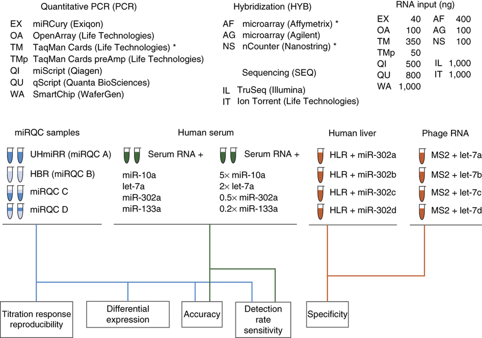


# Exploratory analysis

In this section we will see exploratory figures about quality of the data, 
reads with adapter, reads mapped to miRNAs and reads mapped to other small RNAs. 

## Size distribution

After adapter removal, we can plot the size distribution of the small RNAs. In a normal
small RNA sample, we should see a peak at 22/23 and maybe another at 26 or 31 depending on the biological background.

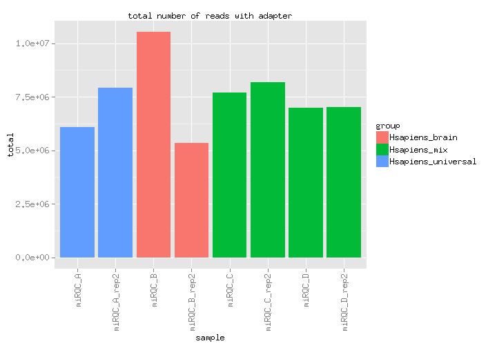 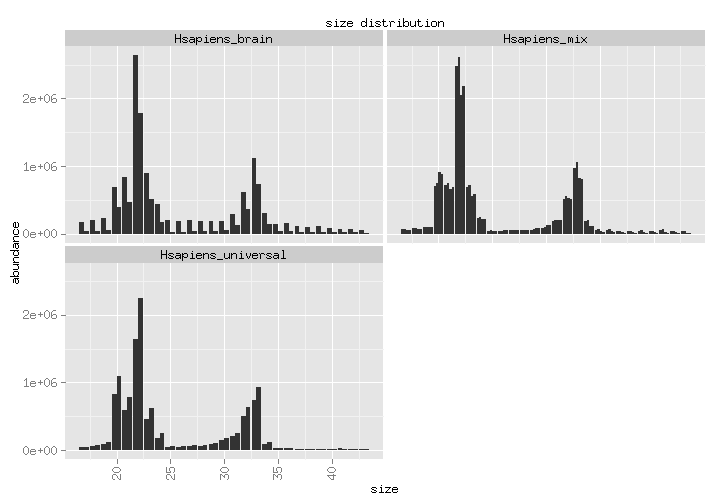 

## miRNA

### Total miRNA expression annotated with mirbase


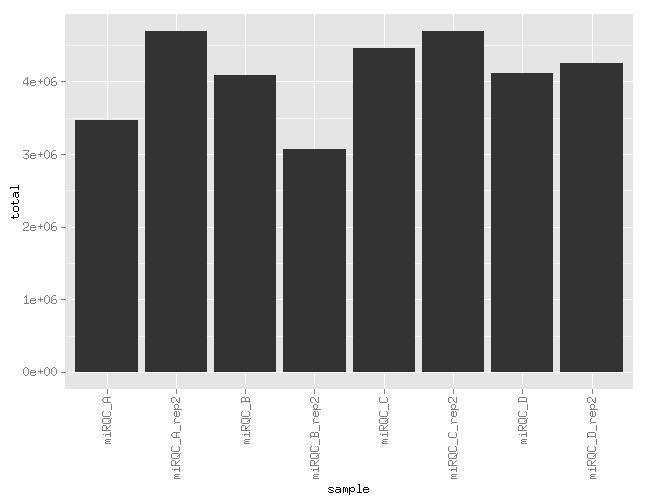 

### Distribution of mirna expression

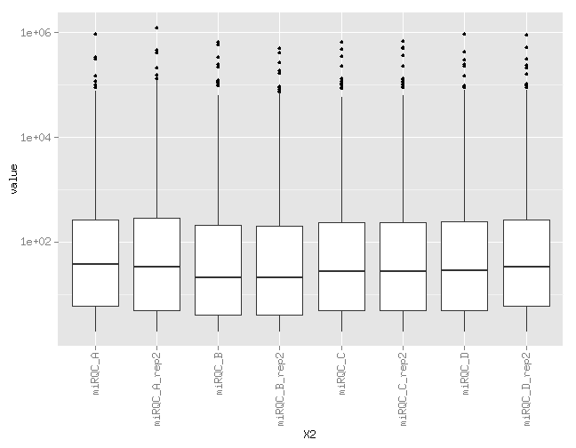 

### Cumulative distribution of miRNAs

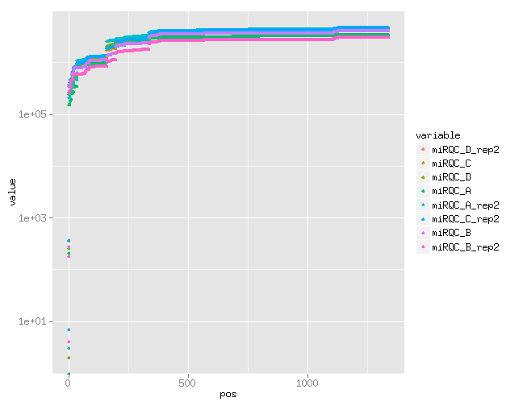 

## Others small RNA

The data was analyzed with [seqcluster](http://seqcluster.readthedocs.org/)

This tools used all reads, uniquely mapped and multi-mapped reads. The first
step is to cluster sequences in all locations they overlap. The second step is to 
create meta-clusters: is the unit that merge all clusters that share the 
same sequences. This way the output are meta-clusters, common sequences that could
come from different region of the genome.

### Genome covered


| coverage| ratio_genome|
|--------:|------------:|
|        0|    0.9992800|
|        1|    0.0007204|

The normal value for data with strong small RNA signal in human is: 0.0002

### Classification

Number of reads in the data after each step:

* raw: initial reads
* cluster: after cluster detection
* multimap: after meta-cluster detection using all hits

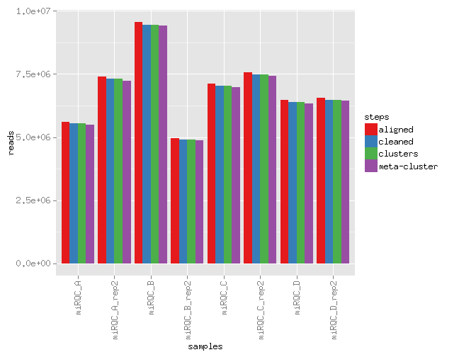 


Check complex meta-clusters: This kind of events happen when there are small RNA over the whole genome, and all
repetitive small RNAs map to thousands of places and sharing many sequences in many positions.
If any meta-cluster is > 40% of the total data, maybe it is worth to add some filters
like: minimum number of counts `-e` or `--min--shared` in `seqcluster prepare`


```
[1] miRQC_D_rep2 miRQC_C      miRQC_D      miRQC_A      miRQC_A_rep2
[6] miRQC_C_rep2 miRQC_B      miRQC_B_rep2
<0 rows> (or 0-length row.names)
```

Until here is an example of the `Rmd` template that the user can get from `seqcluster-helper` and render directly in `R` / `Rstudio`.

Contribution by class:

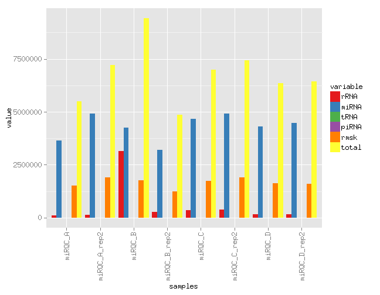 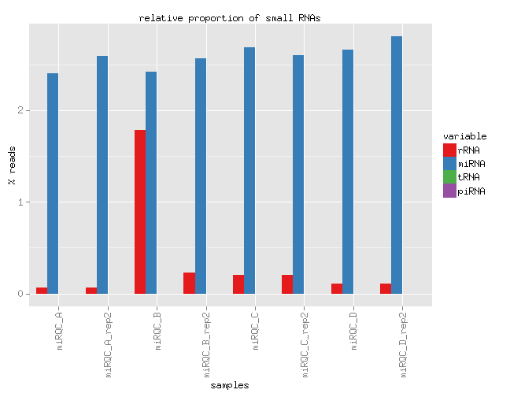 

# Comparison


## miRNA


### Abundance detection of miRQC samples

There are 4 samples:

* A: universal human RNA sample
* B: human brain sample
* C: 0.25 * A + 0.75 * B
* D: 0.25 * B + 0.75 * A

If A > B then A > D > C > B

If A < B then A < D < C < B


Note that C/D samples are swapped in the paper and in the GEO web. Text from the paper:

> These samples (termed miRQC A–D) consist of 100% Universal Human miRNA Reference RNA (UHmiRR; A), 100% human brain RNA (HBR; B) and two titrations thereof (C = 0.75A + 0.25B and D = 0.25A + 0.75B). 

while in the GEO:

> Source name 	miRQC C
Organism 	Homo sapiens
Characteristics 	biomaterial: Mixture of 25% UHRR and 75% HuBr Total RNA

> Source name 	miRQC D
Organism 	Homo sapiens
Characteristics 	biomaterial: Mixture of 75% UHRR and 25% HuBr Total RNA


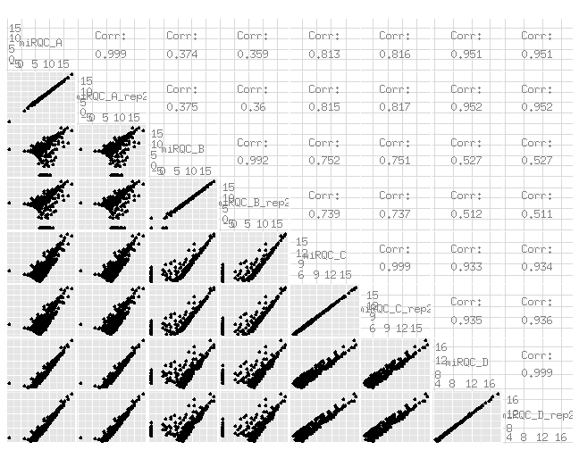 


miRNAs which mirqca > mirqcd > mrqcc are 108 out of 108
miRNAs which mirqcb > mirqcc > mrqcd are 176 out of 185


ratio expression summary of A/D


|   Min.| 1st Qu.| Median|   Mean| 3rd Qu.|   Max.|
|------:|-------:|------:|------:|-------:|------:|
| 0.2708|  0.5009| 0.5736| 0.5729|   0.664| 0.9645|

the average logFC is 0.5 that is similar to the expected FC = log2(1/0.75) = 0.5


ratio expression summary of A/C


|   Min.| 1st Qu.| Median| Mean| 3rd Qu.|  Max.|
|------:|-------:|------:|----:|-------:|-----:|
| 0.4674|   1.158|  1.967| 1.66|   2.109| 2.836|

the average logFC is 1.6 that is similar to the expected FC = log2(1/0.25) = 2

Same happens when comparing B vs D 


|   Min.| 1st Qu.| Median| Mean| 3rd Qu.|  Max.|
|------:|-------:|------:|----:|-------:|-----:|
| 0.3931|   1.101|  1.487|  1.5|   1.923| 2.659|

and B vs C


|   Min.| 1st Qu.| Median|   Mean| 3rd Qu.|  Max.|
|------:|-------:|------:|------:|-------:|-----:|
| 0.3427|  0.7091| 0.8248| 0.8114|  0.9113| 1.119|

according to this: 

miRQC_C = 0.75 * miRQC_B + 0.25 * miRQC_A

miRQC_D = 0.75 * miRQC_A + 0.25 * miRQC_B

that is the same that is in the GEO data set description file.


### Specificity


> we spiked in 8 synthetic miRNAs from two miRNA families into human liver RNA (miR-302a/b/c/d) or MS2-phage RNA (let-7a/b/c/d)

We should only see those miRNAs in those samples and not in anywhere else.


|                                                     | MS2_let.7a.5p| MS2_let.7b.5p| MS2_let.7c| MS2_let.7d.5p|
|:----------------------------------------------------|-------------:|-------------:|----------:|-------------:|
|hsa-let-7a-5p.iso.t5:0.seed:0.t3:0.ad:0.mm:1NT       |             5|             0|          0|             0|
|hsa-let-7a-5p.iso.t5:0.seed:0.t3:0.ad:u-A.mm:0       |             0|             0|          0|             0|
|hsa-let-7a-5p.iso.t5:0.seed:0.t3:d-T.ad:0.mm:0       |             0|             0|          0|             0|
|hsa-let-7a-5p.iso.t5:0.seed:0.t3:u-GTT.ad:u-ATT.mm:0 |            14|             0|          0|             0|
|hsa-let-7a-5p.iso.t5:0.seed:0.t3:u-T.ad:0.mm:0       |             0|             3|          0|             0|
|hsa-let-7a-5p.iso.t5:0.seed:0.t3:u-T.ad:u-G.mm:0     |             0|             0|          0|             0|
|hsa-let-7a-5p.iso.t5:0.seed:0.t3:u-TT.ad:u-A.mm:0    |             0|             0|          0|             0|
|hsa-let-7a-5p.ref.t5:0.seed:0.t3:0.ad:0.mm:0         |           453|             3|         10|             5|


|                                                 | MS2_let.7a.5p| MS2_let.7b.5p| MS2_let.7c| MS2_let.7d.5p|
|:------------------------------------------------|-------------:|-------------:|----------:|-------------:|
|hsa-let-7b-5p.iso.t5:0.seed:0.t3:0.ad:u-A.mm:0   |             0|             0|          0|             0|
|hsa-let-7b-5p.iso.t5:0.seed:0.t3:0.ad:u-AT.mm:0  |             0|             0|          0|             0|
|hsa-let-7b-5p.iso.t5:0.seed:0.t3:d-T.ad:0.mm:0   |             0|             0|          0|             0|
|hsa-let-7b-5p.iso.t5:0.seed:0.t3:d-T.ad:u-T.mm:0 |             0|             0|          0|             0|
|hsa-let-7b-5p.iso.t5:0.seed:0.t3:u-T.ad:0.mm:0   |             0|             0|          0|             0|
|hsa-let-7b-5p.iso.t5:0.seed:0.t3:u-T.ad:u-A.mm:0 |             0|             0|          0|             0|
|hsa-let-7b-5p.iso.t5:0.seed:0.t3:u-TT.ad:0.mm:0  |             0|             0|          0|             0|
|hsa-let-7b-5p.ref.t5:0.seed:0.t3:0.ad:0.mm:0     |             0|           753|          0|             0|


|                                               | MS2_let.7a.5p| MS2_let.7b.5p| MS2_let.7c| MS2_let.7d.5p|
|:----------------------------------------------|-------------:|-------------:|----------:|-------------:|
|hsa-let-7c-5p.iso.t5:0.seed:0.t3:0.ad:u-A.mm:0 |             0|             0|          0|             0|
|hsa-let-7c-5p.iso.t5:0.seed:0.t3:d-T.ad:0.mm:0 |             0|             0|          0|             0|
|hsa-let-7c-5p.iso.t5:0.seed:0.t3:u-T.ad:0.mm:0 |             0|             0|          0|             0|
|hsa-let-7c-5p.ref.t5:0.seed:0.t3:0.ad:0.mm:0   |             0|             0|       1150|             0|


|                                                | MS2_let.7a.5p| MS2_let.7b.5p| MS2_let.7c| MS2_let.7d.5p|
|:-----------------------------------------------|-------------:|-------------:|----------:|-------------:|
|hsa-let-7d-5p.iso.t5:0.seed:0.t3:0.ad:0.mm:12AG |             0|             0|          0|             4|
|hsa-let-7d-5p.iso.t5:0.seed:0.t3:0.ad:0.mm:15AG |             0|             0|          0|             3|
|hsa-let-7d-5p.iso.t5:0.seed:0.t3:0.ad:0.mm:1NA  |             0|             0|          0|             4|
|hsa-let-7d-5p.iso.t5:0.seed:0.t3:0.ad:0.mm:1TA  |             0|             0|          0|             0|
|hsa-let-7d-5p.iso.t5:0.seed:0.t3:0.ad:u-A.mm:0  |             0|             0|          0|             0|
|hsa-let-7d-5p.iso.t5:0.seed:0.t3:d-T.ad:0.mm:0  |             0|             0|          0|             0|
|hsa-let-7d-5p.iso.t5:0.seed:0.t3:u-T.ad:0.mm:0  |             0|             0|          0|             0|
|hsa-let-7d-5p.iso.t5:0.seed:0.t3:u-TT.ad:0.mm:0 |             0|             0|          0|             0|
|hsa-let-7d-5p.ref.t5:0.seed:0.t3:0.ad:0.mm:0    |             0|             0|          0|           262|

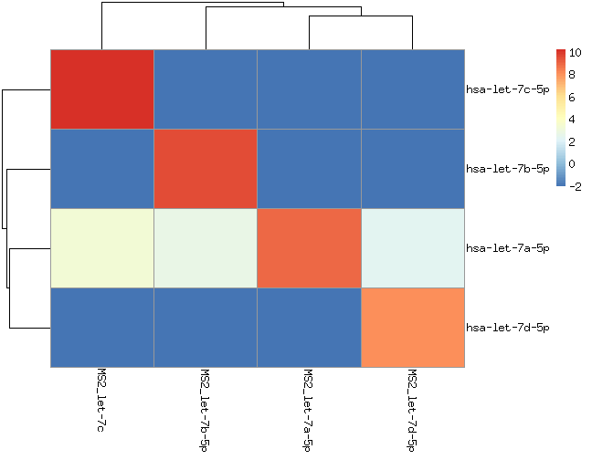 


|                                                    | liver_miR.302a| liver_miR.302b| liver_miR.302c| liver_miR.302d|
|:---------------------------------------------------|--------------:|--------------:|--------------:|--------------:|
|hsa-miR-302a-3p.iso.t5:0.seed:0.t3:u-A.ad:u-G.mm:0  |              3|              0|              0|              0|
|hsa-miR-302a-3p.iso.t5:0.seed:0.t3:u-GA.ad:u-A.mm:0 |              3|              0|              0|              0|
|hsa-miR-302a-3p.ref.t5:0.seed:0.t3:0.ad:0.mm:0      |             41|              0|              0|              0|


|                                                    | liver_miR.302a| liver_miR.302b| liver_miR.302c| liver_miR.302d|
|:---------------------------------------------------|--------------:|--------------:|--------------:|--------------:|
|hsa-miR-302b-3p.iso.t5:0.seed:0.t3:u-G.ad:0.mm:19GA |              3|              0|              0|              0|
|hsa-miR-302b-3p.iso.t5:0.seed:0.t3:u-TAG.ad:0.mm:0  |              0|              2|              0|              0|
|hsa-miR-302b-3p.iso.t5:d-TA.seed:0.t3:0.ad:0.mm:0   |              0|              2|              0|              0|
|hsa-miR-302b-3p.ref.t5:0.seed:0.t3:0.ad:0.mm:0      |              0|             72|              0|              0|


|                                                   | liver_miR.302c| liver_miR.302d| MS2_let.7a.5p| MS2_let.7b.5p|
|:--------------------------------------------------|--------------:|--------------:|-------------:|-------------:|
|hsa-miR-302c-3p.iso.t5:0.seed:0.t3:0.ad:0.mm:18GC  |              0|              2|             0|             0|
|hsa-miR-302c-3p.iso.t5:0.seed:0.t3:0.ad:0.mm:1NT   |              2|              0|             0|             0|
|hsa-miR-302c-3p.iso.t5:0.seed:0.t3:u-TGG.ad:0.mm:0 |              9|              0|             0|             0|
|hsa-miR-302c-3p.ref.t5:0.seed:0.t3:0.ad:0.mm:0     |             85|              0|             0|             0|


|                                                   | liver_miR.302d| MS2_let.7a.5p| MS2_let.7b.5p| MS2_let.7c|
|:--------------------------------------------------|--------------:|-------------:|-------------:|----------:|
|hsa-miR-302d-3p.iso.t5:0.seed:0.t3:u-T.ad:0.mm:0   |              6|             0|             0|          0|
|hsa-miR-302d-3p.iso.t5:0.seed:0.t3:u-T.ad:u-G.mm:0 |              2|             0|             0|          0|
|hsa-miR-302d-3p.iso.t5:d-TA.seed:0.t3:0.ad:0.mm:0  |              2|             0|             0|          0|
|hsa-miR-302d-3p.ref.t5:0.seed:0.t3:0.ad:0.mm:0     |            178|             0|             0|          0|

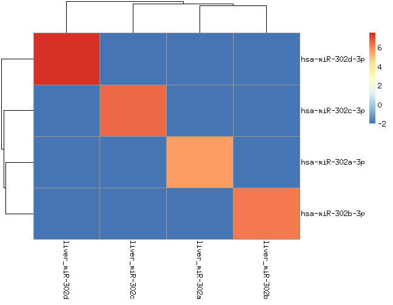 


According to the text they saw cross-mapping between these miRNAs. Here we are seeing almost perfect annotation for miR-302 family and some amplification of the let-7a reference miRNA in the MS-let-7c sample, where the let-7a is in low concentration (10 counts, compared to the expected expression -450 counts-).

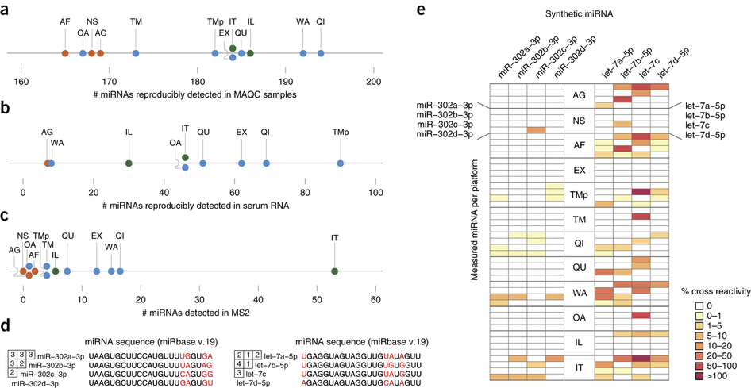

### Accuracy


|                | serum_spiked_miRs_constant| serum_spiked_miRs_constant_repeat| serum_spiked_miRs_variable| serum_spiked_miRs_variable_repeat|
|:---------------|--------------------------:|---------------------------------:|--------------------------:|---------------------------------:|
|hsa-miR-10a-5p  |                  17.504793|                         17.781645|                  19.924425|                         19.626753|
|hsa-let-7a-5p   |                  11.600941|                         11.808433|                  12.687988|                         13.113333|
|hsa-miR-302a-3p |                   5.030905|                          5.030905|                   5.030905|                          5.030905|
|hsa-miR-133a-3p |                   8.981687|                          8.416735|                   5.030905|                          5.030905|

For miR10 and let-7a the changes are clear although not proportional.

I cannot detect sequences for miR-302 and miR-133 (< 5 reads). I checked directly in the raw data and these sequences are not there.

I think they weren't captured by the sequencing at all. The text shows the same for miR-302, and not 
detection in changes for miR-133 ( I guess for the same reason).


|                                                    | serum_spiked_miRs_constant| serum_spiked_miRs_constant_repeat| serum_spiked_miRs_variable| serum_spiked_miRs_variable_repeat|
|:---------------------------------------------------|--------------------------:|---------------------------------:|--------------------------:|---------------------------------:|
|hsa-miR-302a-3p.iso.t5:0.seed:0.t3:u-A.ad:u-G.mm:0  |                          0|                                 0|                          0|                                 0|
|hsa-miR-302a-3p.iso.t5:0.seed:0.t3:u-GA.ad:u-A.mm:0 |                          0|                                 0|                          0|                                 0|
|hsa-miR-302a-3p.ref.t5:0.seed:0.t3:0.ad:0.mm:0      |                          0|                                 0|                          0|                                 0|


|                                                       | serum_spiked_miRs_constant| serum_spiked_miRs_constant_repeat| serum_spiked_miRs_variable| serum_spiked_miRs_variable_repeat|
|:------------------------------------------------------|--------------------------:|---------------------------------:|--------------------------:|---------------------------------:|
|hsa-miR-133a-3p.iso.t5:0.seed:0.t3:d-T.ad:0.mm:0       |                          0|                                 0|                          0|                                 0|
|hsa-miR-133a-3p.iso.t5:d-T.seed:0.t3:d-T.ad:0.mm:0     |                          0|                                 0|                          0|                                 0|
|hsa-miR-133a-3p.iso.t5:d-TT.seed:0.t3:d-T.ad:u-GT.mm:0 |                          0|                                 0|                          0|                                 0|
|hsa-miR-133a-3p.ref.t5:0.seed:0.t3:0.ad:0.mm:0         |                          3|                                 2|                          0|                                 0|

These two miRNAs were the ones that supposed to be down by 2 and 5 times in the serum with variable []. Since, these miRNAs are not detected in the samples with higher [] (serum with constant []) it would be imposible to detecte them in the other two. I would say there is a bias when the platform capture the sequences, and these two are not being detected, meanwhile there is less problems for let-7a and miR-10a

## isomiRs

As an example of some figures you can do with this package.  (read more [here](http://lpantano.github.io/isomiRs)). 

There is one figure per type of isomiR. 
The y-axes shows the percentage of unique sequences with that change.
The x-axes shows the percentage of abundance with that change.

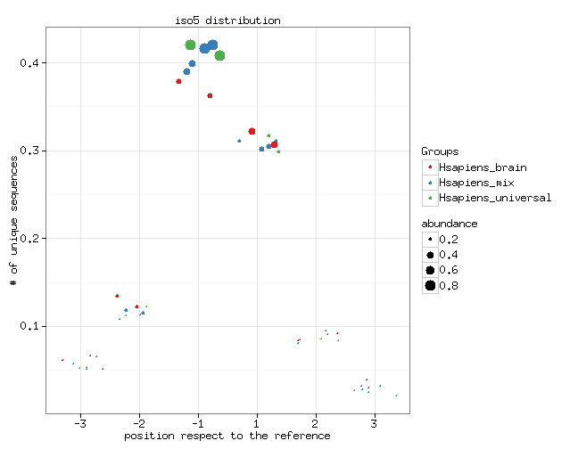 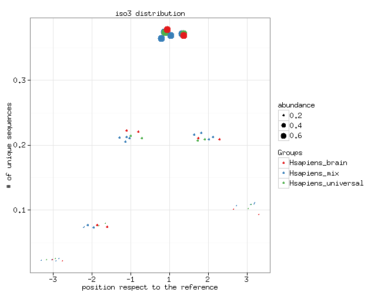 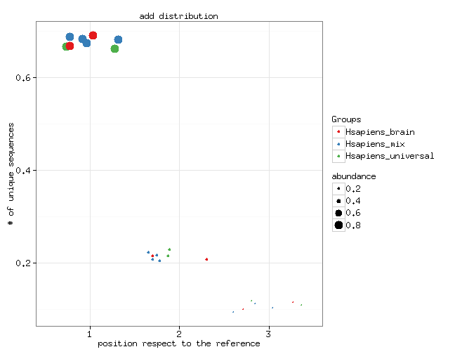 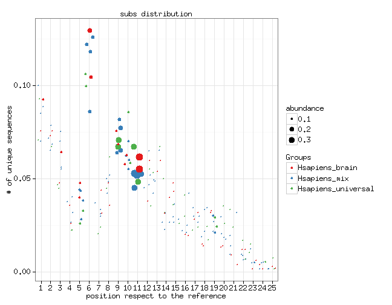 

It seems there are some nt-changes for serum and MS2 samples at position 13/14, 
and at position 9-11 for miRQC and liver samples. These are just
exploratory figures and could lead to a differential
expression analysis of isomiRs.

We can explore the porsition 11 better.

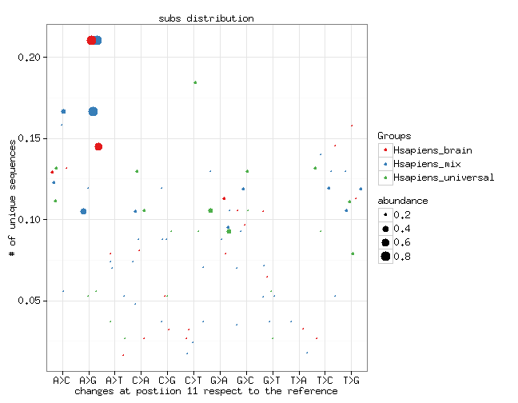 

This shows that the main change is from A > G (maybe A > I) changes that are common
in human brain reigons.

## Clusters
 
The same logic was applied to clusters detection.


### Matrix correlation among samples

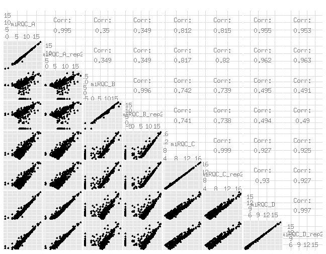 

### Abundance detection


clusters which mirqca > mirqcd > mrqcc are 144 (78 are miRNAs) out of 152

clusters which mirqcb > mirqcc > mrqcd are 236 (137 out of 246

ratio expression summary of A/D


|    Min.| 1st Qu.| Median|   Mean| 3rd Qu.|   Max.|
|-------:|-------:|------:|------:|-------:|------:|
| -0.1368|  0.2407| 0.3634| 0.3459|  0.4484| 0.7401|

the average logFC is 0.3 that is similar to the expected FC = log2(1/0.75) = 0.41 


ratio expression summary of A/C


|    Min.| 1st Qu.| Median|  Mean| 3rd Qu.|  Max.|
|-------:|-------:|------:|-----:|-------:|-----:|
| -0.4756|  0.5723|  1.616| 1.293|   1.917| 2.492|

the logFC is 1.6 that is similar to the expected FC = log2(1/0.25) = 2

Same happens when comparing B vs D 


|     Min.| 1st Qu.| Median|  Mean| 3rd Qu.|  Max.|
|--------:|-------:|------:|-----:|-------:|-----:|
| 0.003321|  0.8069|  1.201| 1.264|   1.645| 3.812|

and B vs C


|    Min.| 1st Qu.| Median|   Mean| 3rd Qu.|  Max.|
|-------:|-------:|------:|------:|-------:|-----:|
| -0.7294|   0.348|  0.476| 0.4847|  0.5858| 2.499|

The exactly same thing than we saw for miRNA analysis and in concordance
with the samples description file.

# Conclusions

We can conclude that the miRNAs and clusters quantification is accurate. The mapping annotation for miRNAs is perfect with those examples, and the difference detection is good for 2 miRNAs, and bad for the other two miRNAs due to a lack of reads support for those miRNAs.

In general, `seqbuster/seqcluster` show good accuracy for abundance detection and mapping accuracy for miRNAs.

# Thanks

special thanks to the author of that papers to make data available. I encourage to use this data for any tool that analyze small RNA data.
